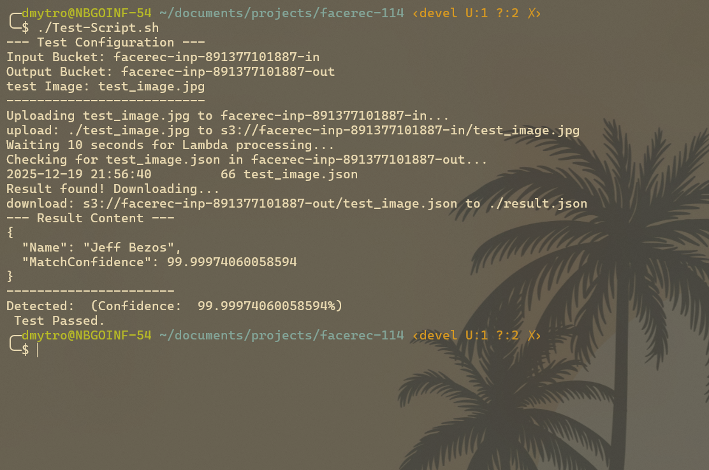
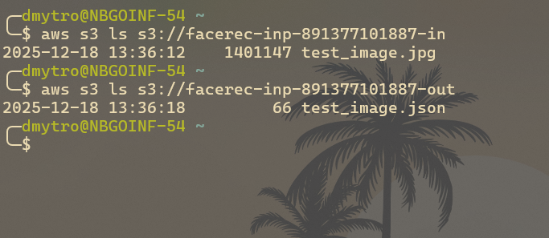

# Test Protocol

| Date | Tester | Version |
| :--- | :--- | :--- |
| 2025-12-19 | Julian/Dima | 1.0 |

## 1. Test Configuration
*   **Trigger Mechanism**: Upload to S3 Input Bucket
*   **Logic**: AWS Lambda function with Rekognition
*   **Verification**: Download JSON from S3 Output Bucket

## 2. Test Execution Log

### Step 1: Upload Image
*   **Action**: Ran `Test-Script.sh` which uploaded `test_image.jpg`.
*   **Expected Result**: Image appears in input bucket.
*   **Observation**: (Passed)

### Step 2: Processing
*   **Action**: Waited 10 seconds.
*   **Expected Result**: Lambda triggers and processes image.
*   **Observation**: (Passed)

### Step 3: Result Verification
*   **Action**: Script downloaded `result.json`.
*   **Output**:
    ```json
    {
    "Name": "Jeff Bezos",
    "MatchConfidence": 99.99974060058594
    }
    ```
*   **Formatted Output**:
    > Detected: Jeff Bezos (Confidence: 99.99974060058594%)

## 3. Screenshots






## 4. Conclusion
The system successfully recognized the person in the image. The automation via `Init.sh` and `Test-Script.sh` works as expected. All components (S3, Lambda, Rekognition) interacted correctly.
